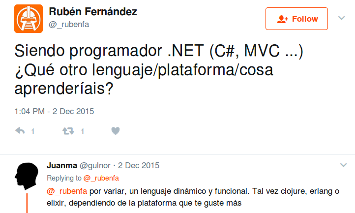
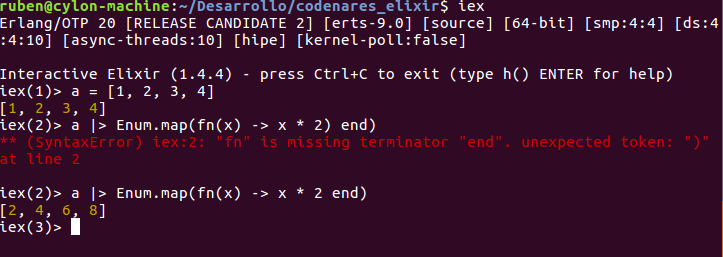
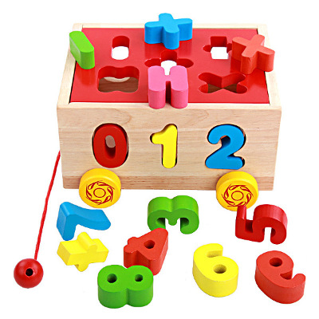

## Elixir para <span style="font-size:0.6em; color:gray">~~tontos~~</span> todos
---
## ¿Quién soy yo?
#### Resumen: un tío normal, que hace cosas normales
#### A veces escribo en un blog: [www.charlascylon.com](www.charlascylon.com)
#### En Twitter soy @_rubenfa.

---
## Elixir para <span style="font-size:0.6em; color:gray">~~tontos~~</span> todos
#### Objetivo
---

#### ¿Y por qué lo de tontos?

+++?image=https://raw.githubusercontent.com/rubenfa/codenares_elixir/master/img/patricio1.jpg
---
#### Primer contacto con la programación funcional con Caml


- En la universidad 
- En el laboratorio de Programación avanzada  
- **Curioso, pero inútil** 

---
#### ¿Y después de tantos años por qué volver a la programación funcional?
+++?image=https://raw.githubusercontent.com/rubenfa/codenares_elixir/master/img/awesome.jpg
---

### ¿Pero qué lenguaje elegir?

---

#### ¿Haskell?

```
fib n = go n (0,1)
  where
    go !n (!a, !b) | n==0      = a
                   | otherwise = go (n-1) (b, a+b)
```

---

#### ¿Erlang?

```
-compile(export_all).
fib_p(0)->0;
fib_p(1)->1;
fib_p(N)->fib_p(N-1)+fib_p(N-2).
%% with guards
fib_g(N) when N == 0 ->0;
fib_g(N) when N == 1->1;
fib_g(N) when N >= 2 -> fib_g(N-1)+fib_g(N-2).
%% tail recursion
tail_fib_h(End,N,LastFib,SecondLastFib) ->
  case N of
    End -> LastFib + SecondLastFib;
    0 -> tail_fib_h(End, 1, 0, 0) ;
    1 -> tail_fib_h(End, 2, 1, 0) ;
    _ -> tail_fib_h(End,N+1,SecondLastFib+LastFib,LastFib)
  end.
tail_fib(N)->
     tail_fib_h(N,0,0,0).
```

---

---

#### Pues F\#

```
let extraeDigitos x = 
    x/10, x - (x/10 *10)   

let sumaDigitos tupla = 
    let x, y = tupla
    x + y
        
let numeros10 = 
    [
        for i in 11..99 do
            if (sumaDigitos (extraeDigitos i)) = 10 then
                yield i
    ]
            
[<EntryPoint>]
let main argv = 
printfn "%A" numeros10
```
---
#### ¿Y cómo empecé con Elixir?


---
### ¿Qué es Elixir?

- Creado por Jose Valim
- Funcional
- Dinámico
- Diseñado para hacer aplicaciones mantenibles y escalables
---
#### Vamos, que es otro frikilenguaje, ¿o sirve para algo?

- Elixir corre sobre la máquina virtual de Erlang (BEAM) (since 1986) 
- Puedes hacer aplicaciones backend
- Aplicaciones web con Phoenix (framework)

---
#### Por fin, una sintaxis funcional que entiendo
+++?image=https://raw.githubusercontent.com/rubenfa/codenares_elixir/master/img/patricio2.jpg
---
#### IEX (Interactive Elixir)

---
#### Elixir es de tipado dinámico
```
iex(2)> 1 + 1
2
iex(3)> 1 + "1"
** (ArithmeticError) bad argument in arithmetic expression
    :erlang.+(1, "1")
iex(3)> 
```
---
### TIPOS
#### Atoms
```
iex(9)> :uno
:uno
iex(10)> :dos
:dos
iex(11)> :uno == String.to_atom("uno")
true
```
---
### TIPOS
#### Listas
```
iex(14)> [1,2, true, "cuatro", 5]
[1, 2, true, "cuatro", 5]
iex(15)> [1,2,6,7] ++ [4,5]
[1, 2, 6, 7, 4, 5]
iex(16)> [1,2,true,3,4,false] -- [true,false]
[1, 2, 3, 4]
``` 
---
### TIPOS
#### Tuplas

``` elixir
result = {1, :error, "Variable not found"}
{1, :error, "Variable not found"}
iex(19)> {result_value, result_atom, result_message} = result
{1, :error, "Variable not found"}
iex(20)> result_value
1
iex(21)> result_atom
:error
iex(22)> result_message
"Variable not found"
``` 
@[1-2]
@[3-4]
@[5-10]
---
### TIPOS
#### Listas clave valor

``` elixir
iex(23)> [{:nombre, "Rubén"}, {:apellido,"Fernández"}, {:edad, 22}]
[nombre: "Rubén", apellido: "Fernández", edad: 22]
iex(24)> [nombre: "Rubén", apellido: "Fernández", edad: 22]
[nombre: "Rubén", apellido: "Fernández", edad: 22]
iex(25)> persona = [nombre: "Rubén", apellido: "Fernández", edad: 22]
[nombre: "Rubén", apellido: "Fernández", edad: 22]
iex(26)> persona[:nombre]
"Rubén"
```
@[1-2]
@[3-4]
@[5-8]

---
### TIPOS
#### Maps

``` elixir
iex(27)> %{ :nombre => "Rubén", "apellido" => "Fernández", 22 => false} 
%{22 => false, :nombre => "Rubén", "apellido" => "Fernández"}
iex(29)> persona = %{ :nombre => "Rubén", "apellido" => "Fernández", 22 => false}
%{22 => false, :nombre => "Rubén", "apellido" => "Fernández"}
iex(30)> persona[22]
false
```
---
### TIPOS
#### Estructuras

```elixir
defmodule Persona do
    defstruct nombre: "", apellido: "", edad: 0
end
```

```
iex(2)> persona = %Persona{nombre: "Rubén", apellido: "Fernández", edad: 22}
%Persona{apellido: "Fernández", edad: 22, nombre: "Rubén"}
iex(3)> persona.edad
22
iex(4)> persona.nombre
"Rubén"
```
---
#### Elixir se organiza en módulos y funciones

```
defmodule MyModules.HelloWorld do

  def hello(selection) do   
    get_message(selection)
  end

  defp get_message(s) do
    cond do
      s == 0 -> IO.puts("Hello world")
      s == 1 -> IO.puts("Hello Codenares")
      s == 2 -> IO.puts("Hello Torrejon")
      true -> {:error, "Message not found"}
    end
  end
end
```
@[7-14]
---
#### Entonces descubrí el Pattern Matching

---
#### Pattern Matching (cláusulas de guarda)
```
defmodule MyModules.PatternMatching.HelloWorld do

  def hello(selection) do   
    get_message(selection)
  end

  defp get_message(s) when s == 0, do: IO.puts("Hello world")
  defp get_message(s) when s == 1, do: IO.puts("Hello Codenares")
  defp get_message(s) when s == 2, do: IO.puts("Hello Torrejón")
  defp get_message(s), do: {:error, "Message not found"} 

end
```
@[7-9]
@[10]
---
#### Pattern Matching (tuplas)
```
defmodule MyModules.PatternMatching.Tuples do

  def calculate({:sum, x, y}), do:  x + y
  def calculate({:res, x, y}), do: x - y
  def calculate({:mul, x, y}), do: x * y
  def calculate({:div, x, y}), do: x / y
  def calculate(other), do: {:error, "Operation not valid"}

end
```
@[3-6]
@[7]

---

#### Pattern Matching (listas)
```elixir
defmodule MyModules.PatternMatching.Lists do

  def sum([]), do: 0
  def sum([head | []]), do: head 
  def sum([head |tail]), do:  head + sum(tail)
 
end
```

---

#### Pattern Matching (estructuras)
```
defmodule MyModules.PatternMatching.Player do
  defstruct name: "", level: 1, type: :warrior, health: 100, alive: true

  alias MyModules.PatternMatching.Player

  def attack(%Player{alive: false}, _, _ ) do
    {:error, "A dead player cannot attack"}
  end

  def attack(_,  %Player{alive: false}, _ ) do
    {:error, "A player cannot attack a dead player"}
  end

  def attack(p1 = %Player{type: :warrior}, p2 = %Player{type: :wizard}, damage) do
    update_health(p2, damage*2)
  end

  def attack(_, p2 = %Player{}, damage) do
    update_health(p2, damage)
  end

  defp update_health(p = %Player{health: h}, damage) when h <= damage do
    %{p | health: 0, alive: false}
  end

  defp update_health(p = %Player{health: h}, damage)  do
    %{p | health: (p.health - damage)}
  end
end
```
@[6-12]
@[14-20]